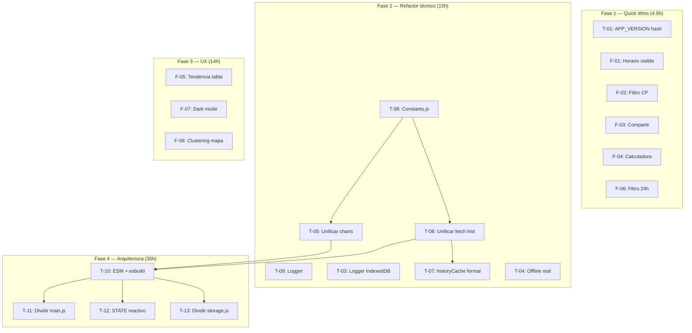

# Plan de Mejoras — Precios Gasolina España

> Estado: **Planificado** · Priorización: **MoSCoW** (Must/Should/Could/Won't)
> Generado: 19/07/2026 tras revisión de 19 archivos (~3700 líneas)

## Priorización de paquetes de trabajo

### P1 — Must (Calidad crítica, bugs potenciales)

| ID | Mejora | Archivos afectados | Esfuerzo | Dependencias |
|----|--------|--------------------|----------|-------------|
| T-01 | APP_VERSION automática (hash de assets) | `sw.js`, + script build | 1h | — |
| T-02 | tests unitarios para `comparePrices()`, `parsePrice()`, `getDiscountedPrice()` | `tests/unit/helpers.test.mjs` | 3h | T-10 (ESM) |
| T-03 | log de errores IndexedDB no silencioso | `js/db.js`, `js/logger.js` | 1h | — |
| T-04 | estado offline real (cache API en SW → mostrar datos cacheados, no offline.html) | `sw.js` | 2h | — |

### P2 — Should (Mejora significativa de mantenibilidad)

| ID | Mejora | Archivos afectados | Esfuerzo | Dependencias |
|----|--------|--------------------|----------|-------------|
| T-05 | unificar drawPriceChart + drawPopupPriceChart en chart-renderer.js | `js/chart-engine.js`, `js/map.js`, `js/chart-renderer.js` (nuevo) | 4h | T-10 (ESM) |
| T-06 | unificar fetchProvinceHistory (api.js + sw.js → db.js) | `js/api.js`, `sw.js`, `js/db.js` | 2h | T-10 (ESM) |
| T-07 | reemplazar window._historyCache por caché formal en db.js | `js/table.js`, `js/map.js`, `js/db.js` | 2h | T-06 |
| T-08 | mover constantes duplicadas a js/constants.js | `js/state.js`, `sw.js`, `js/api.js`, `js/constants.js` (nuevo) | 1h | T-10 |
| T-09 | gestión de errores centralizada (logger.js) | `js/logger.js` (nuevo), todos los archivos | 3h | — |

### P3 — Could (Features de UX con alta visibilidad)

| ID | Mejora | Archivos afectados | Esfuerzo | Dependencias |
|----|--------|--------------------|----------|-------------|
| F-01 | mostrar horario en detail panel y popup | `js/table.js`, `js/map.js`, `css/styles.css` | 30min | — |
| F-02 | filtro por código postal | `index.html`, `js/controls.js` | 1h | — |
| F-03 | compartir estación (Web Share API) | `js/table.js`, `js/map.js` | 1h | — |
| F-04 | calculadora de coste de repostaje | `js/table.js`, `index.html` | 1h | — |
| F-05 | indicador de tendencia en tabla (▲/▼ 7d) | `js/table.js`, `js/controls.js` | 3h | T-06 |
| F-06 | filtro 24h (checkbox solo gasolineras abiertas 24h) | `index.html`, `js/controls.js` | 1h | — |
| F-07 | dark mode (CSS variables + prefers-color-scheme) | `css/styles.css`, `index.html` | 3h | — |
| F-08 | clustering de marcadores Leaflet.markercluster | `js/map.js`, `index.html` (CDN) | 4h | — |

### P4 — Won't (para próxima iteración)

| ID | Mejora | Esfuerzo | Notas |
|----|--------|----------|-------|
| T-10 | ES Modules + build step (esbuild) | 12h | Requiere reestructurar todo el JS |
| T-11 | dividir main.js (595 → 3 archivos) | 6h | Más fácil tras T-10 |
| T-12 | STATE reactivo con Proxy | 8h | Tras T-10, T-11 |
| T-13 | dividir storage.js (3 archivos) | 3h | Tras T-10 |
| T-14 | exportación CSV | 2h | — |
| F-09 | comparativa entre provincias | 6h | Requiere caché multi-provincia |
| F-10 | más baratos por localidad | 2h | — |
| F-11 | detail panel draggable | 4h | — |
| F-12 | autocomplete en búsqueda | 1h | — |

---

## Detalle de cada mejora

### T-01 — APP_VERSION automática

**Problema**: `APP_VERSION` (entero) en `sw.js` debe incrementarse manualmente.
Si se olvida, el SW no detecta cambios y los usuarios no reciben assets nuevos.

**Solución**: Script Node.js que calcula MD5 de todos los assets y lo inyecta:

```powershell
# scripts/version.mjs
import { createHash } from 'crypto';
import { readFileSync, readdirSync } from 'fs';
const assets = ['index.html','sw.js','css/styles.css','js/state.js',...];
const hash = createHash('md5').update(assets.map(f => readFileSync(f)).join('')).digest('hex').slice(0,8);
// Reescribe sw.js: const APP_VERSION = "a3f2c9d1";
```

Añadir a `package.json`:
```json
"scripts": {
  "build:version": "node scripts/version.mjs"
}
```

**Archivos**: `sw.js`, `scripts/version.mjs` (nuevo), `package.json`

---

### T-02 — Tests unitarios

**Problema**: Funciones críticas sin cobertura.

**Solución**: Tests con `node:test` y `assert` nativos:

| Test | Funciones | Casos |
|------|-----------|-------|
| helpers | `comparePrices()` | bajada, subida, sin cambio, precios null |
| helpers | `parsePrice()` | "1,459", "1.459", "", null, "1,5" |
| helpers | `getDiscountedPrice()` | con descuento, sin descuento, descuento > precio |
| helpers | `formatLogTime()` | formato dd/mm/yy hh:mm:ss |
| state | `FUEL_GROUPS` | grupos correctos, sin solapamiento |

```powershell
# tests/unit/helpers.test.mjs
import { describe, it } from 'node:test';
import assert from 'node:assert';
import { comparePrices, parsePrice } from '../../js/helpers.js';

describe('comparePrices', () => {
  it('detecta bajada: 1.50 vs 1.60', () => {
    const r = comparePrices(1.50, 1.60);
    assert.ok(r);
    assert.strictEqual(r.isRise, false);
    assert.strictEqual(r.difference, 0.10);
  });
  it('retorna null si igual', () => {
    assert.strictEqual(comparePrices(1.50, 1.50), null);
  });
});
```

**Archivos**: `tests/unit/helpers.test.mjs` (nuevo)

---

### T-03 — Logger no silencioso

**Problema**: Todos los `catch` en `db.js` hacen `resolve(null)` sin log.

**Solución**:

```js
// js/logger.js
const LOG_LEVELS = { DEBUG: 0, INFO: 1, WARN: 2, ERROR: 3 };
let level = LOG_LEVELS.WARN;

export function logError(context, error) {
  if (level <= LOG_LEVELS.ERROR) {
    console.error(`[${context}]`, error?.message || error);
  }
}

export function setLogLevel(l) { level = l; }
```

En `db.js`:
```js
req.onerror = (e) => {
  logError('IndexedDB:dbGet', e.target.error);
  db.close();
  resolve(null);
};
```

**Archivos**: `js/logger.js` (nuevo), `js/db.js`, `js/api.js`, `js/storage.js`

---

### T-04 — Offline real con datos cacheados

**Problema**: El SW usa network-first para API, pero cuando falla red mira en
caché de API. Si no hay nada en caché, sirve `offline.html`. Pero **sí hay datos
en IndexedDB** que podrían mostrarse.

**Solución**: En `sw.js`, cambiar la estrategia de fetch para la API:

```js
if (url.hostname === API_HOST) {
  e.respondWith(
    fetch(e.request).then(res => {
      const clone = res.clone();
      caches.open(CACHE).then(cache => cache.put(e.request, clone));
      return res;
    }).catch(() =>
      caches.match(e.request).then(cached =>
        cached || caches.match(BASE + 'offline.html')
      )
    )
  );
  return;
}
```

**Archivos**: `sw.js`

---

### T-05 — Unificar chart engine

**Problema**: `chart-engine.js` y `map.js` tienen implementaciones casi
idénticas de dibujo de gráfica + tooltip hover. ~180 líneas duplicadas (~80%).

**Solución**: Crear `js/chart-renderer.js` con una función `drawLineChart()`
parametrizada:

```js
// js/chart-renderer.js
export function drawLineChart(canvas, data, opts = {}) {
  const {
    padTop = 24, padRight = 24, padBottom = 22, padLeft = 56,
    gridCount = 4, fontSize = 10, axisFontSize = 9,
    lineColor = '#1a73e8', tooltipEnabled = true,
  } = opts;

  const ctx = canvas.getContext('2d');
  const dpr = window.devicePixelRatio || 1;
  const rect = canvas.getBoundingClientRect();
  // ... misma lógica con parámetros
}

export function drawTooltip(ctx, point, canvas, dpr) {
  // ... lógica única de tooltip
}
```

**chart-engine.js** llama con defaults:
```js
drawLineChart(canvas, data, { padTop: 24, gridCount: 4 });
```

**map.js** llama con opciones compactas:
```js
drawLineChart(canvas, data, { padTop: 14, padRight: 14, padBottom: 18, padLeft: 38, gridCount: 3, fontSize: 9 });
```

Luego eliminar `drawPriceChart`, `drawPopupPriceChart`, `drawTooltip`,
`drawPopupTooltip`, `onChartHover`, `onChartLeave`, `onPopupChartHover`,
`onPopupChartLeave` de los archivos originales.

**Archivos**: `js/chart-renderer.js` (nuevo), `js/chart-engine.js` (refactor),
`js/map.js` (refactor)

---

### T-06 — Unificar fetch de histórico

**Problema**: `fetchProvinceHistory()` en `api.js` y `fetchProvinceHistorySW()`
en `sw.js` son casi idénticas. `getStationHistory()` y `getStationHistorySW()`
también.

**Solución**: Mover ambas funciones a `db.js` (ya compartido entre cliente y SW
via `importScripts`):

```js
// En db.js
function _formatDateDDMMYYYY(date) { /* ... */ }

export async function fetchProvinceHistory(provinceId, days, apiBase) {
  const dates = [];
  for (let i = days; i >= 1; i--) {
    const d = new Date();
    d.setDate(d.getDate() - i);
    d.setHours(0, 0, 0, 0);
    dates.push(d);
  }
  const results = {};
  const CHUNK = 3;
  for (let i = 0; i < dates.length; i += CHUNK) {
    const chunk = dates.slice(i, i + CHUNK);
    await Promise.all(chunk.map(async (date) => {
      const dateStr = _formatDateDDMMYYYY(date);
      const cacheKey = 'hist_' + provinceId + '_' + dateStr;
      let cached = await dbGet('cache', cacheKey);
      if (cached?.data) { results[dateStr] = cached.data; return; }
      try {
        const r = await fetch(apiBase + 'EstacionesTerrestresHist/FiltroProvincia/' + dateStr + '/' + provinceId);
        if (r.ok) {
          const json = await r.json();
          results[dateStr] = json.ListaEESSPrecio || [];
          await dbPut('cache', cacheKey, { data: results[dateStr], timestamp: Date.now() });
        }
      } catch(e) { /* logError */ }
    }));
  }
  return results;
}

export function getStationHistory(historyByDate, stationId, fuelName) {
  // ... misma lógica actual
}
```

**api.js** y **sw.js** importan y llaman a las mismas funciones.

**Archivos**: `js/db.js`, `js/api.js`, `sw.js`

---

### T-07 — Reemplazar window._historyCache

**Problema**: Variable global compartida entre `table.js` y `map.js` sin control.

**Solución** en `db.js`:

```js
const _historyCache = { province: null, days: null, data: null, timestamp: 0 };

export function getHistoryCache() { return _historyCache; }

export function setHistoryCache(province, days, data) {
  _historyCache.province = province;
  _historyCache.days = days;
  _historyCache.data = data;
  _historyCache.timestamp = Date.now();
}

export function invalidateHistoryCache() {
  _historyCache.data = null;
  _historyCache.timestamp = 0;
}
```

Uso en `table.js`:
```js
// antes: if (!window._historyCache || window._historyCache.province !== s.selectedProv...)
// después:
const cache = getHistoryCache();
if (!cache.data || cache.province !== s.selectedProv || cache.days !== s.historyDays) {
  const data = await fetchProvinceHistory(...);
  setHistoryCache(s.selectedProv, s.historyDays, data);
}
```

**Archivos**: `js/db.js`, `js/table.js`, `js/map.js`

---

### T-08 — Constants.js

**Problema**: Mismas constantes en múltiples archivos.

**Solución**:

```js
// js/constants.js
export const APP_VERSION = 2;
export const API_BASE = 'https://sedeaplicaciones.minetur.gob.es/ServiciosRESTCarburantes/PreciosCarburantes/';
export const CACHE_NAME = 'gasolineras-v3';
export const CDN_CACHE_NAME = 'gasolineras-cdn-v1';
export const STATE_KEY = 'gasolineras_state';
export const PUSH_SUBSCRIPTION_KEY = 'gasolineras_push_subscription';
export const PROV_FILTER_PREFIX = 'gasolineras_prov_filters_';
export const DB_NAME = 'gasolineras_db';
export const DB_VERSION = 2;
```

Cargar en SW con `importScripts` y en cliente via `<script>` o ESM.

**Archivos**: `js/constants.js` (nuevo), `js/state.js`, `js/db.js`, `js/storage.js`,
`js/api.js`, `js/push-notifications.js`, `sw.js`

---

### T-09 — Logger centralizado

Ver T-03 (incluye logger).

**Archivos**: `js/logger.js` (nuevo), todos los archivos .js

---

### F-01 — Mostrar horario

En `showDetail()` (`table.js`):
```js
// Añadir tras detailAddr
const horario = d.Horario ? `<div class="horario">🕐 ${d.Horario}</div>` : '';
document.getElementById('detailHorario').innerHTML = horario;
```

En `popupHtml()` (`map.js`):
```js
// Añadir tras popup-addr
const horario = d.Horario ? `<div>🕐 ${d.Horario}</div>` : '';
```

CSS:
```css
.horario { font-size: 0.72rem; color: #666; margin-bottom: 0.2rem; }
```

**Archivos**: `js/table.js`, `js/map.js`, `index.html`, `css/styles.css`

---

### F-02 — Filtro por código postal

En `index.html` toolbar:
```html
<div class="filter-group">
  <span class="filter-group-label">📮 CP</span>
  <input type="text" id="cpFilter" maxlength="5" placeholder="C.P." style="width:50px">
</div>
```

En `controls.js` → `render()`:
```js
const cp = document.getElementById('cpFilter').value.trim();
if (cp) arr = arr.filter(d => (d['C.P.'] || '').startsWith(cp));
```

**Archivos**: `index.html`, `js/controls.js`

---

### F-03 — Compartir estación

```js
// En table.js, dentro de showDetail
const shareBtn = document.getElementById('shareBtn');
shareBtn.style.display = 'inline';
shareBtn.onclick = async () => {
  const price = getSelectedFuelPrice(d);
  const text = `⛽ ${d.Rótulo}\n📍 ${d.Dirección}, ${d.Localidad}\n💰 ${price?.toFixed(3)}€/L`;
  if (navigator.share) {
    await navigator.share({ title: 'Precio gasolina', text });
  } else {
    await navigator.clipboard.writeText(text);
  }
};
```

En `index.html`, dentro del detail panel:
```html
<button id="shareBtn" style="display:none">📤 Compartir</button>
```

**Archivos**: `index.html`, `js/table.js`

---

### F-04 — Calculadora de coste

En `index.html`, dentro de detail panel `#detailTabInfo`:
```html
<div class="cost-calc">
  <label>Depósito: <input type="number" id="calcLiters" value="40" min="1" step="5"> L</label>
  <span id="calcTotal"></span>
</div>
```

CSS:
```css
.cost-calc { margin-top: 0.5rem; display: flex; align-items: center; gap: 0.5rem; font-size: 0.75rem; }
.cost-calc input { width: 55px; padding: 0.2rem; border: 1px solid #ddd; border-radius: 4px; }
.cost-calc #calcTotal { font-weight: bold; color: #1a73e8; }
```

En `table.js`:
```js
document.getElementById('calcLiters').addEventListener('input', updateCalcTotal);

function updateCalcTotal() {
  const liters = parseFloat(document.getElementById('calcLiters').value);
  const station = STATE.data.find(x => x.IDEESS === STATE.selectedId);
  if (!station || isNaN(liters) || liters <= 0) return;
  const price = getSelectedFuelPrice(station);
  document.getElementById('calcTotal').textContent = price ? (liters * price).toFixed(2) + ' €' : '';
}
```

**Archivos**: `index.html`, `js/table.js`, `css/styles.css`

---

### F-05 — Indicador de tendencia

En `controls.js` → `render()`, tras filtrar, enriquecer cada estación con
tendencia usando el histórico cacheados (misma lógica que T-06/T-07):

```js
// Pseudocódigo
async function enrichTrend(arr) {
  const cache = getHistoryCache();
  if (!cache.data) return;
  arr.forEach(d => {
    const hist = getStationHistory(cache.data, d.IDEESS, STATE.selectedFuel);
    if (hist.length < 2) { d._trend = null; return; }
    const last = hist[hist.length - 1].price;
    const prev = hist[hist.length - 2].price;
    d._trend = last > prev ? 'up' : last < prev ? 'down' : 'stable';
  });
}
```

En `table.js`, en las filas:
```js
const trendIcon = d._trend === 'up' ? ' <span class="trend-up">▲</span>'
  : d._trend === 'down' ? ' <span class="trend-down">▼</span>' : '';
```

**Archivos**: `js/controls.js`, `js/table.js`, `css/styles.css`

---

### F-06 — Filtro 24h

En `index.html` toolbar:
```html
<div class="filter-group">
  <label style="font-size:0.6rem;white-space:nowrap">
    <input type="checkbox" id="open24hFilter"> 24h
  </label>
</div>
```

En `controls.js` → `render()`:
```js
if (document.getElementById('open24hFilter').checked) {
  arr = arr.filter(d => d.Horario && d.Horario.includes('24H'));
}
```

**Archivos**: `index.html`, `js/controls.js`

---

### F-07 — Dark mode

CSS:
```css
:root {
  --bg: #f0f2f5;
  --card-bg: #fff;
  --text: #1a1a2e;
  --border: #e0e0e0;
  --toolbar-bg: #fff;
  --table-header-bg: #343a40;
  --table-header-text: #fff;
  --table-row-hover: #f1f3f5;
  --table-row-selected: #cce5ff;
  --input-bg: #fff;
  --info-bar-bg: rgba(255,255,255,0.95);
}

@media (prefers-color-scheme: dark) {
  :root {
    --bg: #121212;
    --card-bg: #1e1e1e;
    --text: #e0e0e0;
    --border: #333;
    --toolbar-bg: #1a1a2e;
    --table-header-bg: #1a1a2e;
    --table-header-text: #e0e0e0;
    --table-row-hover: #2a2a3e;
    --table-row-selected: #1a3a5e;
    --input-bg: #2a2a3e;
    --info-bar-bg: rgba(26,26,46,0.95);
  }
}
```

Reemplazar todos los colores fijos en `styles.css` por `var(--xxx)`.

Toggle manual en Config:
```html
<label><input type="checkbox" id="darkModeToggle"> Modo oscuro</label>
```
```js
document.getElementById('darkModeToggle').addEventListener('change', e => {
  document.documentElement.setAttribute('data-theme', e.target.checked ? 'dark' : 'light');
});
```

**Archivos**: `css/styles.css`, `index.html`

---

### F-08 — Clustering de mapa

Añadir CDN Leaflet.markercluster en `index.html`:
```html
<link rel="stylesheet" href="https://unpkg.com/leaflet.markercluster@1.5.3/dist/MarkerCluster.css" />
<link rel="stylesheet" href="https://unpkg.com/leaflet.markercluster@1.5.3/dist/MarkerCluster.Default.css" />
<script src="https://unpkg.com/leaflet.markercluster@1.5.3/dist/leaflet.markercluster.js"></script>
```

En `map.js`:
```js
let markerCluster = null;

function updateMarkers(fitBounds, onMarkerClick) {
  if (markerCluster) STATE.map.removeLayer(markerCluster);
  markerCluster = L.markerClusterGroup({
    chunkedLoading: true,
    maxClusterRadius: 50,
    spiderfyOnMaxZoom: true,
    showCoverageOnHover: false,
  });
  // ... crear markers como antes, pero:
  // m.addTo(markerCluster) en vez de m.addTo(s.map)
  // markerCluster.addTo(s.map)
}
```

**Archivos**: `index.html`, `js/map.js`

---

## Orden de implementación recomendado



## Métricas de seguimiento

| KPI | Valor actual | Target F1 | Target F2 | Target F3 | Target F4 |
|-----|-------------|-----------|-----------|-----------|-----------|
| Código duplicado (líneas) | ~260 (7%) | 260 (7%) | ~30 (1%) | ~30 (1%) | 0 |
| Archivos >400 líneas | 2 (main.js, sw.js) | 2 | 2 | 2 | 0 |
| Tests unitarios | 0 | 0 | 30+ | 30+ | 80+ |
| Offline real | No | No | Sí | Sí | Sí |
| Errores silenciosos | Todos | Todos | Logeados | Logeados | Logeados |
| Features competidores | ~60% | ~70% | ~70% | ~85% | ~90% |
| Estado arquitectura | Legacy | Legacy | Legacy | Mejorado | Moderno |
